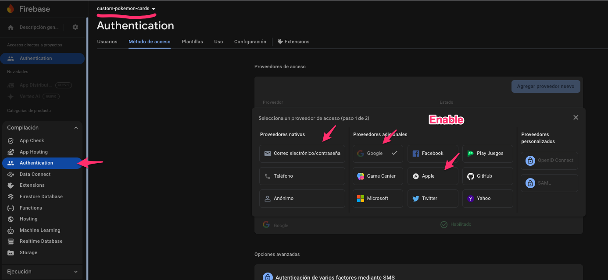
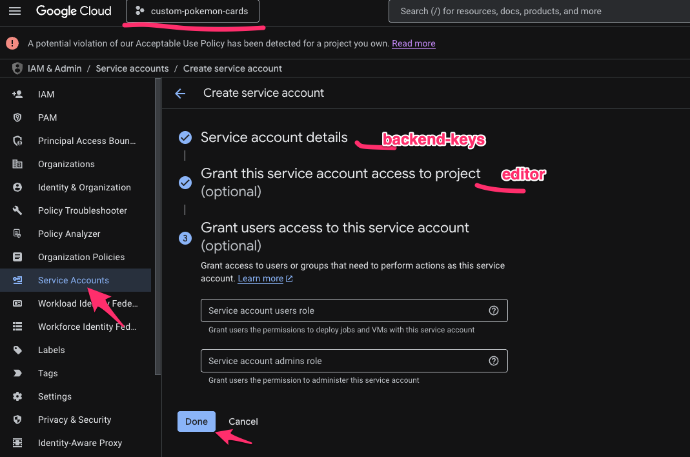

# 🚀 Setting Up Your Custom Project

This guide will walk you through setting up a complete development environment for your Custom Pokemon Cards application using our pre-built templates. Follow these steps to get a fully functional web application with Angular frontend, Node.js backend, and Python support for AI features.

## 📋 Project Setup

### 1️⃣ Project Planning

First, decide on your project name. For this example, we'll use:

**Custom Pokemon Cards**: An application to generate new Pokemon cards.

### 2️⃣ Clone Template Repositories

Create a folder for your projects and clone all three template repositories:

bash

```bash
git clone https://github.com/dataclouder-dev/startup-template-angular.git custom-pokemon-cards-angular
git clone https://github.com/dataclouder-dev/startup-template-node.git custom-pokemon-cards-node
git clone https://github.com/dataclouder-dev/startup-template-python.git custom-pokemon-cards-python
```

You should have this directory structure:

```
/pokemon-cards/
   ├── custom-pokemon-cards-angular
   ├── custom-pokemon-cards-node
   └── custom-pokemon-cards-python
```

## 💻 Setting Up the Angular Frontend

1. Navigate to the Angular project directory
2. Install dependencies:

   bash

   ```bash
   npm install --force
   ```

   > Note: The `--force` flag is necessary because some libraries have not updated their package modules and incorrectly require Angular 18, though they are compatible with Angular 19.

3. Start the development server:

   bash

   ```bash
   npm run start
   ```

At this point, you should be able to see the landing page. However, most features require login functionality, which we'll set up next.

## 🖥️ Setting Up the Node.js Backend

1. Navigate to the Node.js project directory
2. Install dependencies:

   bash

   ```bash
   npm install
   ```

### 🗄️ Database Configuration

Before running the backend, you'll need a MongoDB database:

1. Create an account on MongoDB Atlas
2. Set up a free shared cluster (allows unlimited databases within the 500MB free tier)

   > Tip: You can also use serverless MongoDB which is faster and costs only cents per million requests

3. Copy the `.env.example` file to `.env` and update the MongoDB variables:

   ```
   MONGO_USER=your_user
   MONGO_PASS=your_user_pass
   MONGO_HOST=cluster0.xxxxxxx.mongodb.net
   MONGO_DB=your_db
   ```

4. Start the backend server:

   bash

   ```bash
   npm run start
   ```

5. Access the API documentation at `http://localhost:8080/docs`

## 🔗 Connecting Frontend and Backend

At this point, your frontend and backend are working independently but not connected. This is because requests are authenticated.

While you could remove the authentication guard (`@UseGuards(AppGuard, AuthGuard)`) to allow open requests, most methods require authentication to extract the Firebase token ID. The backend automatically creates users when they don't exist in the system. It's highly recommended to set up Firebase authentication.

## ⚙️ Automated Project Setup

The setup process is automated using Make. If you don't have it installed:

bash

```bash
brew install make
```

Make is a powerful tool for automating commands. Alternatively, you can execute the commands from the Makefile manually. but not cover in this guide.

## 🔥 Firebase Integration

Return to the Angular project to add Firebase credentials and prepare for deployment:

1. You'll need to rename the project from the template defaults. The template includes a script called `rename_project` (written in Python). after that there will be no clue or hint that you started the project using a template, is yours now.

2. In the Makefile, update these variables:

   - `PROJECT_ID`: Will be used as your Firebase free domain and google cloud id (must be unique)
   - `PROJECT_NAME`: Can be the same as PROJECT_ID

   > 💡 Tip: For multiple environments, add a suffix to your project ID (e.g., my-project-dev, my-project-qa, my-project-pro)

So if you set custom-pokemon-cards you can expect to have custom-pokemon-cards.web.app as free domain. (is nobody has taken it)

3. The `APP_ID` is for Android and iOS integration (not required initially)

Go ahead and rename the project. settings files where there is a reference to the name like capacitor, ionic, package, tsconfig and index html will be modified.

```bash
make rename_project
```

To initialize your project with Firebase:

1. Navigate to the Angular project directory
2. Run:

   bash

   ```bash
   make init-project
   ```

This script depends on Firebase SDK, Node, and npm. If you don't have these, they will be installed automatically. The script will log you into Firebase via the CLI, opening a browser window for authentication.

If everything goes well, your new Firebase credentials will be set in `src/environments/environment.ts`.

alternative you can create manually in console.firebase, youll see this project.

## 🔐 Final Setup: Firebase Authentication

There's one manual step that couldn't be automated: enabling authentication providers in Firebase.

1. The Firebase console link should appear in your terminal
2. Open the link and navigate to Authentication → Sign-in method
3. Enable the authentication providers you want with a single click (template is only ready to handle email, google and apple, that all you need for an app)



## 🎉 Success!

You're all set! You can now authenticate using any account - even create fake email accounts for testing. and you should the users autenticated in firebase, but were are not done yet, becouse now backend need to create user app data, and only then when the backend is able to retrive this, user  can use the app. otherwise will be send to not_found. 


### Creating Google Credentials. 
Firebase uses Google Cloud under the hood, so at the end you also have a Google cloud project. go to your project credentials sections, check the example for quick link substitube 'custom-pokemon-cards' with your project id. 

https://console.cloud.google.com/apis/credentials?invt=AbubAw&project=custom-pokemon-cards

put a name like backend-keys and grant the editor role.  (if you know Google Cloud then you know, add minimal priviledge)



Then create a key for your service account, this will be downloable as json format, place it in the project in .cred/keys.json, and now backend is able to decofied authenticated request,  and we can finally navigate in the app. 

Optinally you can set python backend. 


