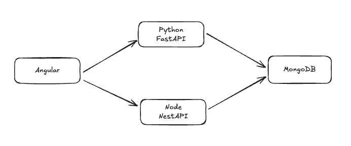
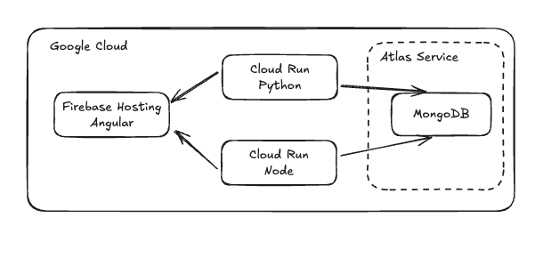

# 🚀 Business Project Template: Your Fast-Track to Development Success

This project provides a robust template to jumpstart your business applications, eliminating the tedious setup process and letting you focus on what matters most - building your unique business logic.

## 🤔 Why This Template?

Starting a new project from scratch can be overwhelming. Common components like authentication systems, role management, Firebase integration, and email validation require significant setup time but are fundamentally similar across projects. By packaging these repeatable elements into reusable Angular libraries, this template dramatically reduces your development timeline. Angular stands out as an ideal framework for this approach due to its robust architecture and exceptional modularity. While other frameworks have their strengths, Angular's comprehensive toolkit makes it particularly well-suited for business applications requiring scalable, maintainable codebases.

## 🏗️ Architecture Overview

In today's tech landscape, choosing the right technologies can be challenging. While React and NestJS have gained significant market share, this template leverages Angular and NestJS for optimal modularity and maintainability. The shared TypeScript foundation between frontend and backend creates a seamless development experience with consistent typing throughout.

Additionally, this template acknowledges Python's dominance in data analysis and AI applications by incorporating a three-tiered approach:

- Angular for the frontend
- NestJS for primary backend services
- FastAPI for Python-based analytics and AI integration as secondary backend

This architecture gives you the best of all worlds without compromising on development speed or application performance.



## 💾 Database Considerations

After extensive experimentation with various solutions including Firebase, MongoDB emerged as the optimal choice for rapid development while maintaining stability. The template is designed with NoSQL relationships in mind, though a PostgreSQL adapter is planned for future releases to provide SQL options.

MongoDB Atlas offers cloud hosting with a generous 500MB free tier, making it ideal for development and small-scale production applications.

## 🔐 Authentication: Firebase vs Supabase

Both Firebase and Supabase offer excellent authentication services with comparable free tiers (approximately 50K authentications per month). This template utilizes Firebase primarily because it also provides free domain and hosting options, streamlining the deployment process. The template includes ready-to-use Firebase integration, allowing deployment with a single command.

## ☁️ Cloud Platform Integration

While the template isn't tied to any specific cloud provider, it includes pre-configured scripts and CI/CD pipelines optimized for Google Cloud. The infrastructure leverages services with generous free tiers, including Cloud Run's 1,000,000 free API calls per month.

All components are containerized with Docker, giving you the flexibility to deploy anywhere according to your preferences.



## 📱 Mobile App Support

This template doesn't stop at web applications - it comes ready for mobile development through Ionic and Capacitor integration. The Ionic framework provides the UI layer while Capacitor connects with native mobile components, enabling you to build both Android (APK) and iOS (IPA) applications from the same codebase.

While deploying mobile apps requires some additional knowledge, this template provides the foundation. More detailed documentation for mobile deployment will be added in future versions.

## 🚦 Getting Started

1. Clone the Angular codebase
2. Clone the NestJS codebase
3. Optionally clone the Python codebase (recommended for AI/ML features)

For each project:

bash

```bash
make install
```

Add the required environment variables to the backend project, then start the development servers with:

bash

```bash
make start
```

After successful startup, your application will be available at `localhost:4200`.

At this point, it's recommended to save the project to your own Git repository and begin developing your business idea with this solid foundation in place.

if you want o go deeper in every project read the readme in their repositories.

Angular: https://github.com/dataclouder-dev/startup-template-angular

NestJS: https://github.com/dataclouder-dev/startup-template-node

Python: https://github.com/dataclouder-dev/startup-template-python
