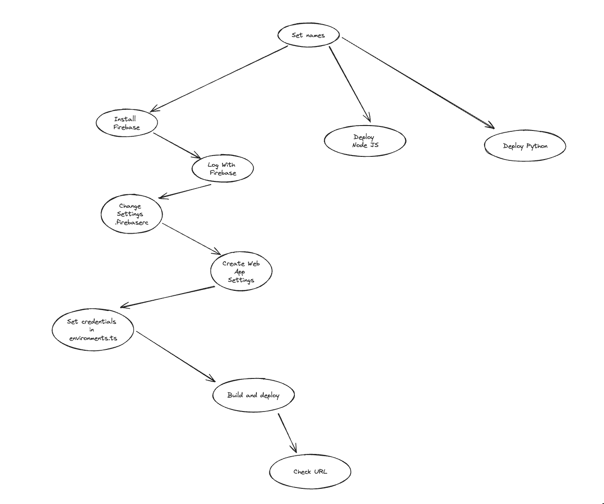

# 🌩 Dataclouder Template Angular/Ionic

A ready-to-use Angular/Ionic template with Firebase Authentication integration.

> ⚠️ **Note**: This project is currently under development and may contain bugs.

## ✨ Features

- 🔐 Firebase Authentication
- 🔑 Google, Apple, Email/Password Sign In
- 📱 Mobile Support (Android, iOS)
- 🌐 Web Support
- ⚡ Backend Support (Nest.js, FastAPI)
- 🔄 CI/CD Automation (Google Cloud Build)
- 🎯 And more...

## 🚀 Getting Started

This template provides a foundation for new projects. While you can run it locally, utilizing features like authentication, CI/CD, and Google Cloud Services requires setting up your own credentials and project names.

### Option 1: Auto Setup

Make is required for the auto setup. It usually comes pre-installed on Unix-based systems.

0. Clone the repository:

   ```bash
   git clone https://github.com/dataclouder-dev/dataclouder-template-ionic.git [optional-project-name]
   ```

   Update the Makefile variables with your project name and app ID.

1. Rename the project:

   ```bash
   make rename-project
   ```

   This command will rename all necessary files and variables (requires Python).

   Required variables:

   - `PROJECT_ID`: Your Firebase project ID
   - `APP_ID`: Your application ID (format: com.your-domain.app-name)
   - `DISPLAY_NAME`: The name that will be displayed in the title

   The script will update the following files:

   - `package.json`
   - `ionic.config.json`
   - `environment.ts`
   - `capacitor.config.ts` (Note: App name must be unique)

2. Initialize the project:
   ```bash
   make init-project
   ```
   This will verify dependencies and create a new Firebase project automatically.

## �� Configuration

### 🔥 Firebase Setup Manually

if you already have a firebase project, you can skip the auto setup and do it manually.

1. Create a new Firebase project (or use existing)
2. Copy Firebase credentials to `environment.ts`
3. Enable Authentication methods:
   - Navigate to Firebase Console → Authentication
   - Enable Email/Password and Google sign-in
   - Add authorized domains (localhost is included by default)



### Change the Firebase credentials.

Get credentials from the Firebase console (create a new project if you don't have one). Copy and paste the credentials in the environment.ts.

That's all at this point. You should be able to run the app and be able to sign up using email or Google.

    npm run start

### Add storage to Firebase.

- You need to change the project to Firebase Blaze and add a billing account.
- Initialize Storage in the console and set rules (testing rules to start).

### Change Android and iOS IDs. Future work...

    Android (Pending)
    *   build.gradle
    *   strings.xml
    * MainActivity.java -> This concerns me as it is a package name.

    iOS
    *   project.pbxproj
    * Info.plist

2. Add Firebase variables in the environment.ts. Make sure your app is set with permissions to localhost.

- Go to Firebase Authentication https://console.firebase.google.com/project/[your-project]/authentication
- Add email authentication, add Google authentication
- Check authorized domains, by default it is localhost.
- Go to project settings -> your apps and create a new app or get the Firebase data if you already have it. Save this data in environment.ts.
- Done. Sign in and verify at https://console.firebase.google.com/project/[your-project]/authentication/users that you have your new user.

3. Publish the web app.

- Enable hosting at https://console.firebase.google.com/project/[your-project]/apphosting

- npm install -g firebase-tools

  firebase init hosting --project dataclouder-pro Answer the questions directory -> www, single-page app: y -> GitHub no -> override yes

  This is just to get the firebase.json and .firebaserc files (you can also copy them).

## Run the project

```bash

    npm run install or make init-project
    npm run start or make start
```

Note: you need to set backend in environment.ts in order to connect with methods. check projects.

https://github.com/dataclouder-dev/dataclouder-template-node https://github.com/dataclouder-dev/dataclouder-template-python

## Deploy to firebase

### Manual deploy

```bash
    npm run build
    firebase deploy --only hosting:dataclouder-pro
    firebase deploy --only hosting:dataclouder-dev : change .firebaserc to dataclouder-dev
```

#### deploy using make

    make deploy

### Automatic deploy

Pending... connect with Google Cloud Trigger.s

# 4) Add Android

    1) To avoid delaying other steps, it is best to create your certificate right away.
        * Reasons: It is required for publication and for multiple environments to work.
        * It is required for Google login.

    2) Create keystore.

        * Navigate to the android folder. cd android/app

        * keytool -genkey -v -keystore dataclouder.keystore -alias pro -keyalg RSA -keysize 2048 -validity 10000

        * Prepare to answer:
            name: jordan
            unit: dev
            organization: dataclouder
            city: cdmx
            province: cdmx
            country code: mx
            confirm: y

        * Optional: Create a second key for another environment for greater security, or use the same one for speed and convenience.
        keytool -genkey -v -keystore dataclouder.keystore -alias dev -keyalg RSA -keysize 2048 -validity 10000

        pass: Hola1234

    3) Obtain the corresponding certificates and save them in the credentials.
    keytool -list -v -keystore dataclouder.keystore

        * Go to Google Cloud Console, https://console.cloud.google.com/apis/credentials?project=[your-project], you will see a default Firebase one used by the web.

        * Create an Android client -> Create OAuth client ID

        * Create an Android certificate.

        * (Optional) Add the consent screen.

        * Select your universal ID dev.dataclouder.template.

    4) Add Android to the project (ionic add android is already done but only to compare file changes) or make file configurations.

        * Build Gradle is already prepared, change the variables and environment names / TODO: See if I can change the variables.

        * Modify the main project files.

        * Run the project and test Google authentication.

# Add iOS

    1) Create the iOS authentication credential.
    2) Extract the client ID and reverse client ID data in the Additional Information section.

    TODO: Understand how to extract the developer team, script to change the developer team 97TH9F3GM9.

    From the interface, I set it as a variable $(REVERSED_CLIENT_ID) but here you just need to add the data to the configuration files.
    From the interface, I created the configuration files to modify the pbxproj.

## 🚀 Development

Start the development server:

```bash
npm run start
```

## 📄 License

### Backend

This project also comes with ready to use backend in Nest.js and Python FastAPI.

-> https://github.com/adamofig/dataclouder-python-template

-> https://github.com/adamofig/dataclouder-template-node

## 2) Automate the deployment to Google Cloud CI/CD

Very easy step if you want to automate the deployment on Google Cloud.

#### 1) Create a new project in Google Cloud.

Or use the existing one.

#### 3) Add the secrets for environments ts or upload your environment to your source code if project is private needs to be called, 'environment_secret'

- Add permissions to the service account -> Secret Manager Secret Accessor

#### 4) Create new trigger pointing to the branch you want to deploy.

- create a varible for yaml building script usualy \_ENV = dev or \_ENV = pro.
- this script is the one used in package.json build:dev

#### 5) Create firebase docker images to compile as intermediate steps.

follow instructions here: https://cloud.google.com/build/docs/deploying-builds/deploy-firebase is basically create image container that is able to compile the project, the important commands are:

```bash
# clone the repository
git clone https://github.com/GoogleCloudPlatform/cloud-builders-community.git
cd cloud-builders-community/firebase
# build the image and upload to artifact registry
gcloud builds submit .
```

### About the theme and palete.

### What do you need to know to change the palete?

the project uses primeng and ionic. so you need to change both.

Check documentation: https://ionicframework.com/docs/theming/colors https://primeng.org/theming

Quick intro:

### 🎨 Prime NG Style

Prime NG uses a combination of colors.

emerald, green, lime, red, orange, amber, yellow, teal, cyan, sky, blue, indigo, violet, purple, fuchsia, pink, rose, slate, gray, zinc, neutral, stone

Some of these colors are used by default for different PrimeNG severities (primary, secondary, success, danger, warning, info, dark, light). Example: htmlCopy<p-button icon="pi pi-trash" severity="danger" />

Danger uses the red color Success uses the green color

By default, you can override any color. 🖌️ 💡 Recommendation: The only colors I recommend changing are the primary color and surface color.

--p-primary-color

all variables can be overriden by declaring in css --p-primary-color para el colo principal o --p-primary-200 para la tonalidad.

Color Variables

--p-primary-color: For the main color You can override variables by declaring them in CSS Example: --p-primary-color for the main color or --p-primary-200 for a specific tone

Important Note: There is no --p-primary-color-800, only primary color exists. 📂 File Structure

/src/theme/variables.scss: Add your custom variables here /src/global.scss: Import IONIC CSS and override global styles

You can style Cards, Inputs, and other important components using PrimeNG guidelines. 🛠️ 🕵️ Changing and Inspecting Styling If you're unsure what to change, look for hints like --ion-text-color-rgb. 🎨 Changing the Color Palette Key Concepts:

📄 /src/my-preset.ts

Start here Add the colors you want This will override the default Nora theme Access variables with --p-primary-color or --p-primary-200

### 🌐 /src/global.scss

Override Ionic variables Define PrimeNG component styles Note: Changes may not automatically apply to both PrimeNG and Ionic components

Three sections in global.scss:

Importing styles from other libraries Defining global variables and overriding Ionic ones Defining global styles or overriding current ones

📱 Component Styling The main layout is handled using Ionic components, making it mobile-ready. 🚀

No existe --p-primary-color-800 solo primary color

- /src/theme/variables.scss: here i add my variables.

- /src/global.scss: here i import the IONIC CSS Override the global styles

you can style Cards, Inputs, etc and important compoents using primeng guidelines.

### changing and inspecting styling

if you dont know what to change some times you will see something like, --ion-text-color-rgb to see a clue.

### Ok i want to change the palete.

To start with, I higly recoment have alreay your palet.

There are 3 important concepts:

- /src/my-preset.ts // Start here add the colors you want. this will override default style for Nora (Just a theme) then you can access your variables with --p-primary-color or --p-primary-200 for specific color.

- /src/global.scss: here is only to override Ionic variables. you defined for prime ng components, but undertunately this are not linked, also if you definition not change automatically, if you change varible example changing color for --p-primary-color works for prime ng components but not for ionic components. so since the very beggining you need to define darkmode or other teams if you want.

i see this global.scss in 3 sections.

1. importing styles from other libraries.
2. defining global variables and override ionic ones
3. define global style or otherride current ones.

### Styling speficis components.

The main layout is handled using Ionic components, this way is ready for mobile. check the the file global.css here are important variables to change theme, you can change:

- Menu Right Nav Bar
- Header
- Bottom Quick Access Nav Bar

## My Color Palette

<table>
  <tr>
    <td width="150" bgcolor="#2D0C62">#2D0C62</td>
    <td>Primary Color</td>
  </tr>
  <tr>
    <td bgcolor="#74FAC9">#74FAC9</td>
    <td>Secondary Color</td>
  </tr>
  <tr>
    <td bgcolor="#7FD6D2">#7FD6D2</td>
    <td>Accent Color</td>
  </tr>
    <tr>
    <td bgcolor="#5CBAE7">#5CBAE7</td>
    <td>Accent Color</td>
  </tr>
    <tr>
    <td bgcolor="#3677BD">#3677BD</td>
    <td>Accent Color</td>
  </tr>
</table>

//

| Color   | Name            | Sample                                                                                 |
| ------- | --------------- | -------------------------------------------------------------------------------------- |
| #2D0C62 | Primary Color   |  |
| #74FAC9 | Secondary Color |  |
| #7FD6D2 | Accent Color    |  |
| #5CBAE7 | Accent Color    |  |
| #3677BD | Accent Color    |  |

https://coolors.co/2d0c62-74fac9-7fd6d2-5cbae7-3677bd

### Want to continue receiving updates?

Add as upstream.

make merge-upstream, the first time will add your project, then ill ask you to fix conflicts.
