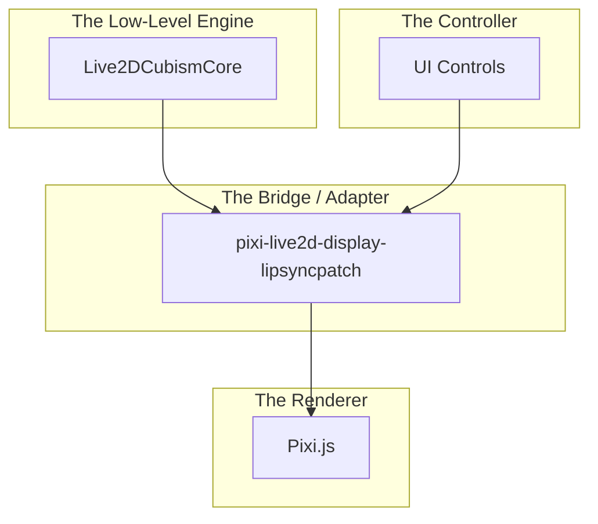

# Live2D Model Loading and Rendering Documentation

This document explains how the [`live2d-playground.component.ts`](src/app/pages/live2d/playground/live2d-playground.component.ts:1) loads, renders, and controls a Live2D model using Angular, Pixi.js, and the `pixi-live2d-display-lipsyncpatch` library.

The core concept is to bypass the model's built-in, pre-defined animations (like idle motions) and instead control its movements directly by manipulating its underlying parameters in real-time.

## Core Technologies

- **Pixi.js**: A fast, lightweight 2D rendering library that provides the WebGL-based canvas and rendering loop.
- **`pixi-live2d-display-lipsyncpatch`**: A specialized library that acts as a bridge between Pixi.js and the Live2D Cubism Core. It handles the loading of `.model3.json` files and exposes the model as a displayable object within Pixi.js.
- **`Live2DCubismCore`**: The low-level, official library from Live2D that performs the core mathematical calculations for deforming the model's mesh based on parameter inputs.

## Why Manual Control vs. Live2D's Built-in Animations?

You are correct that Live2D models have their own system for playing pre-defined animations (e.g., from `.motion3.json` files). This is perfect for standardized actions like waving or idle breathing.

However, the goal of this playground is different: it's about **direct, real-time "puppeteering."** Instead of playing back a recording, we want UI sliders to manipulate the model's individual parts live. To achieve this, we must bypass Live2D's default animation player (`motionManager`) and take manual control.

This is why we set `autoUpdate: false` and disable the `motionManager`, `eyeBlink`, and `breath` modules. We then create our own update loop with the `Pixi.js Ticker`. This custom loop's only job is to re-calculate the model's appearance based on its _current_ parameter values on every frame. When a slider changes a parameter, our loop ensures the model immediately reflects that change, giving us the desired "puppeteering" effect.

## In-Depth: The Role of Each Library

Think of the three core libraries as a chain of command for rendering the model:



1.  **`Live2DCubismCore` (The Engine)**

    - **What it is**: The official, low-level WebAssembly/.js library from Live2D Inc.
    - **Responsibility**: Its sole job is to perform the complex mathematical calculations to deform the model's 2D mesh. It takes parameter values (e.g., `ParamAngleX = 15`) as input and calculates the new vertex positions for the model's textures. It is the "brain" that understands the model's structure.
    - **It does NOT**: Know how to draw to the screen, load files, or manage a scene. It only does the math.

2.  **`pixi-live2d-display-lipsyncpatch` (The Bridge)**

    - **What it is**: An adapter library that makes `Live2DCubismCore` compatible with the `Pixi.js` rendering world.
    - **Responsibility**:
      - **Loading**: Reads the `.model3.json` file and fetches all associated assets (textures, physics, etc.).
      - **Object Management**: Wraps the low-level Core model in a high-level `Pixi.js.DisplayObject`, making it something Pixi.js can understand and render.
      - **API Abstraction**: Provides a friendly JavaScript API (like `model.motion()`, `setParameterValueById()`) so we don't have to interact with the complex Core library directly.
      - **Animation Management**: Contains the `motionManager` and other controllers that we intentionally disable for this project.

3.  **`Pixi.js` (The Renderer)**
    - **What it is**: A general-purpose, high-performance 2D rendering engine for the web.
    - **Responsibility**:
      - **Rendering**: Takes `DisplayObject`s (like our Live2D model) and efficiently draws them to the screen using WebGL.
      - **Scene Graph**: Manages the "stage," a tree of all objects to be rendered.
      - **Ticker (Update Loop)**: Provides the optimized timer that we use to create our manual update loop, ensuring smooth animation.

#### How Pixi.js Renders: WebGL and the Canvas

Pixi.js draws graphics onto an HTML `<canvas>` element. The `<canvas>` itself is just a blank bitmap; its power comes from the **rendering context** you request from it. Pixi.js intelligently chooses the best one available in the user's browser. Here are the main options:

- **WebGL / WebGL2 (Primary Method)**: By default, Pixi.js will try to get a WebGL (or the newer WebGL2) context. These are JavaScript APIs that provide direct access to the computer's Graphics Processing Unit (GPU). This allows for **hardware-accelerated rendering**, which is extremely fast and essential for the smooth animation of complex scenes like a Live2D model.

- **2D Context (Fallback)**: If WebGL is not available, Pixi.js falls back to the standard `"2d"` context. This is the original, CPU-based drawing API for the canvas. It's great for simple shapes and images but lacks the performance of WebGL for demanding animations because it doesn't use the GPU.

- **WebGPU (The Future)**: A brand new, next-generation graphics API for the web. It's a complete redesign that offers even more power and efficiency than WebGL by aligning more closely with modern GPU architectures (like Vulkan, Metal, and DirectX 12). While still emerging, it represents the future of high-performance web graphics.

Pixi.js handles this selection automatically, ensuring the best performance possible while maintaining broad compatibility. It does **not** render using the DOM (e.g., by animating `<div>` or `` tags), as this method is far too slow for real-time graphics.

#### A Note on Three.js

You may have also heard of **Three.js**, another very popular graphics library. It operates on the same principles as Pixi.js (using WebGL/WebGL2 on a `<canvas>`), but its primary focus is on creating **3D graphics**, whereas Pixi.js is highly optimized for **2D**. Both are cornerstone technologies of the modern interactive web.

In summary: **`Live2DCubismCore` is the brain, `pixi-live2d-display` is the translator, and `Pixi.js` is the artist.**

## Step-by-Step Process

### 1. Initialization

The process begins when the component's view is ready, triggered by the `ngAfterViewInit` lifecycle hook.

- **[`initializeCanvas()`](src/app/pages/live2d/playground/live2d-playground.component.ts:55)**: A Pixi.js `Application` is created and linked to the `<canvas>` element in the component's template. This sets up the scene, renderer, and stage where the model will be displayed.

```typescript
this.app = new Application({
  view: document.getElementById('canvas') as HTMLCanvasElement,
  // ... other settings
});
```

### 2. Model Loading

- **[`loadModel(modelPath)`](src/app/pages/live2d/playground/live2d-playground.component.ts:64)**: This is the main function for loading the model.
- **`Live2DModel.from(modelPath)`**: This static method from the `pixi-live2d-display` library is called. It asynchronously fetches and parses the model's `.model3.json` file, along with its associated textures, physics, and motion files.
- **`autoUpdate: false`**: This crucial option is passed during loading. It tells the library not to use its internal update loop, giving us manual control over when the model is rendered.

```typescript
this.model = await Live2DModel.from(modelPath, {
  ticker: Ticker.shared,
  autoUpdate: false, // Disable automatic updates
});
this.app.stage.addChild(this.model);
```

### 3. Disabling Automatic Animations

To achieve fine-grained control, all of the model's built-in automatic behaviors are programmatically disabled.

- **[`deactivateMotions()`](src/app/pages/live2d/playground/live2d-playground.component.ts:103)**: This method is called immediately after the model is loaded.
  - It stops the `motionManager`, which is responsible for playing idle and pre-defined animations.
  - It disables the automatic `eyeBlink` and `breath` animations.

```typescript
// Example from deactivateMotions()
if (this.model.internalModel.motionManager) {
  this.model.internalModel.motionManager.stopAllMotions();
  this.model.internalModel.motionManager.update = () => {}; // Override update method
}
```

### 4. Manual Update Loop

With automatic updates disabled, a custom rendering loop is established using Pixi.js's shared `Ticker`.

- **`Ticker.shared.add(...)`**: A function is added to the ticker, which is called on every animation frame (typically 60 times per second).
- **`model.internalModel.coreModel?.update()`**: This is the most important part of the manual update. It forces the Live2D core model to recalculate its vertex positions based on the _current_ values of its parameters.
- **`model.update(...)`**: This updates the Pixi.js display object, redrawing the model on the canvas with its new state.

```typescript
// From deactivateMotions()
Ticker.shared.add(() => {
  if (this.model && this.model.internalModel) {
    // Only update the model's parameters, not its automatic animations
    this.model.internalModel.coreModel?.update();
    this.model.update(Ticker.shared.deltaMS); // Update the model with delta time
  }
});
```

### 5. Parameter-Driven Movement

This is how the model is made to move. Instead of playing a "wave" animation, we directly change the parameters for "Arm Angle", "Hand Position", etc.

- **[`extractModelInfo()`](src/app/pages/live2d/playground/live2d-playground.component.ts:134)**: After loading, this function inspects the `coreModel` and extracts a list of all available parameters (e.g., `ParamAngleX`, `ParamEyeLOpen`) and parts. This data is used to populate the UI with controls (like sliders in the `ModelInfoComponent`).
- **[`updateModelParameter(...)`](src/app/pages/live2d/playground/live2d-playground.component.ts:176)**: This method is called when a UI control (like a slider) is changed.
  - It receives the parameter's ID and the new value.
  - It calls **`coreModel.setParameterValueById(id, value)`**. This is the command that directly manipulates the model's state.
  - Because the manual update loop from Step 4 is constantly running, this change is immediately reflected on the rendered model in the next frame.

## Summary Flow

1.  **Init**: `ngAfterViewInit` -> `initializeCanvas()`
2.  **Load**: `loadModel()` -> `Live2DModel.from()`
3.  **Disable**: `deactivateMotions()` stops all internal animation systems.
4.  **Control**: The UI (`ModelInfoComponent`) displays sliders for each parameter extracted by `extractModelInfo()`.
5.  **Update**: Changing a slider calls `updateModelParameter()`.
6.  **Manipulate**: `setParameterValueById()` changes the model's internal state.
7.  **Render**: The `Ticker` loop calls `coreModel.update()` and `model.update()`, redrawing the model with the new parameter values, creating smooth, user-driven movement.
